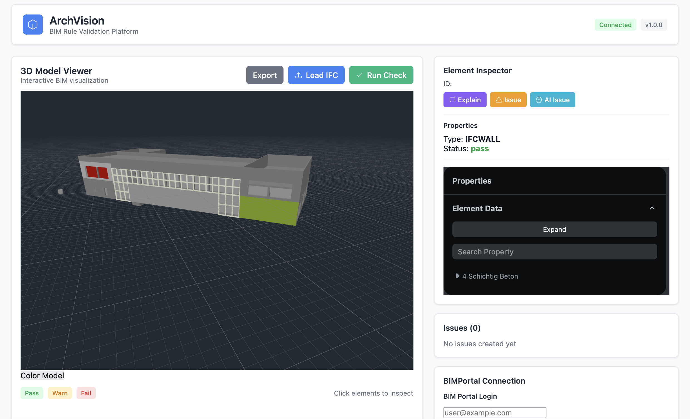
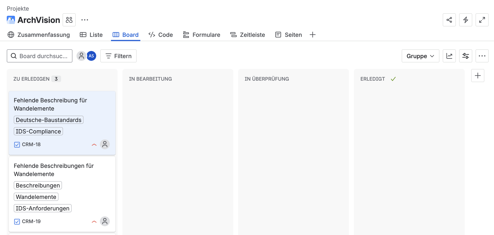
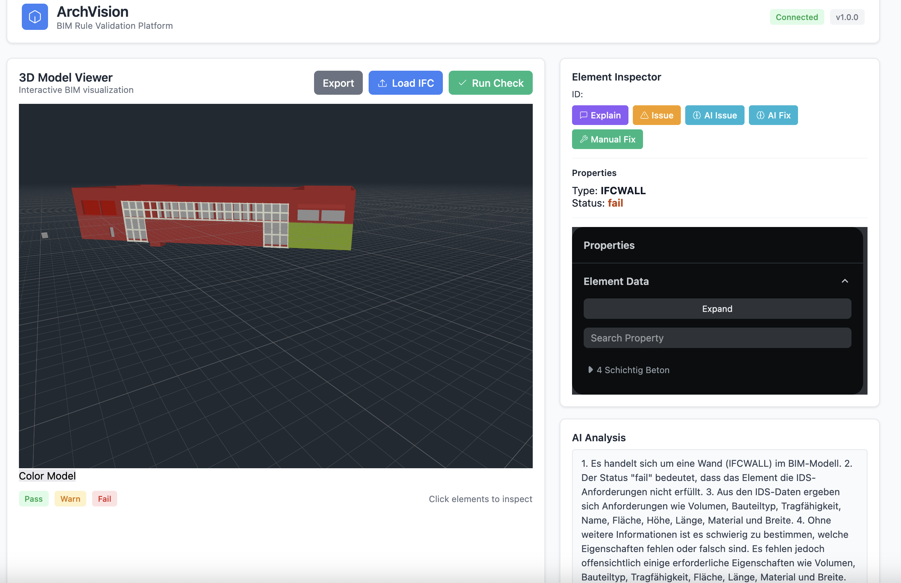
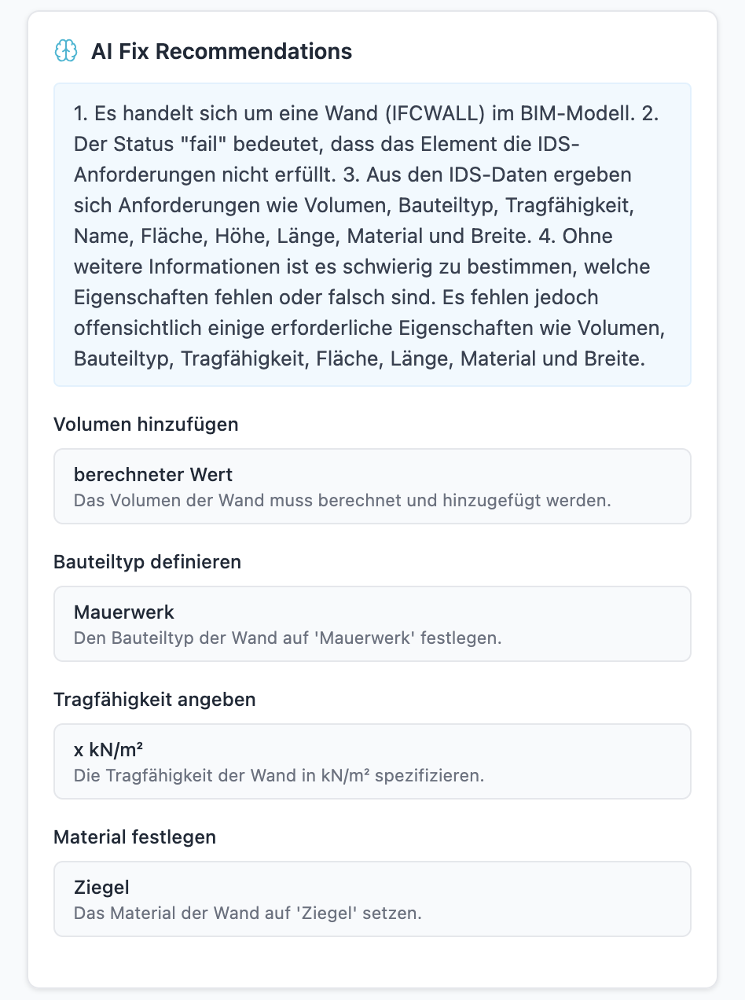

# BIM Rule-Check Visualizer

A React-based  (BIM) IDS visualizer with AI helper integration. Directly attached to the "BIM Portal" of the German Federal Government. Developed for the Hackathon "BIM Portal 2025" and it was the winning project for first place.



## Features

- **3D Viewer**: Interactive IFC viewer with property insights and highlighting of individual elements
- **Rule Checking**: Automated rule validation for building elements via IDS
- **Issue Tracking**: Create and manage issues tied to specific building elements. Create BCF Files with LLM and connect to Jira for tocket creation trough API
- **LLM Integration**: AI explanations for rule violations and element properties and provides fixing assistance
- **Interactive Selection**: Click on 3D elements to view their properties and status

### Integrations
- OpenAI API (or compatible) for AI query
- Jira for automatic ticket management 
- BCF Download


*Seamless integration with Jira for automated ticket creation and tracking*

## Getting Started

### Prerequisites

- Node.js (v14 or higher)
- npm or yarn

### Installation

1. Install dependencies:
```bash
npm install
```

2. Start the development server:
```bash
npm start
```
3. Start Backend server:
```bash
python backend.py
```

The application will open in your browser at `http://localhost:8080`.

## Usage

1. **View the 3D Scene**: The viewer shows the uploaded IFC and can be interacted with trough clicking on each IFC Element
2. **Run IDS Check**: Click "Run Rule Check" to validate elements against building rules. Statuses are highlighted on each ifc element trough coloring
3. **Select Elements**: Click on any 3D element to select it and view its properties
4. **Get AI Explanations and Recommendations**: Select an element and click "Explain (LLM)" for AI-generated insights or click "AI Fix" for quick fixes
5. **Create Issues**: Report problems by clicking "Create Issue" for selected elements and create bcf files. Ticket Generation for Jira trough API

### AI-Powered Analysis

The application provides intelligent analysis of rule violations with actionable recommendations:



When an element fails validation, the AI can analyze the issue and provide detailed fix recommendations:



## Rule Validation

Elements are color-coded based on rule compliance:
- 🟢 **Green (Pass)**: All required properties present
- 🟡 **Yellow (Warn)**: Some properties missing
- 🔴 **Red (Fail)**: Critical properties missing


## Technologies Used

- React 18
- OpenBIM-Components 3.1
- Typescript
